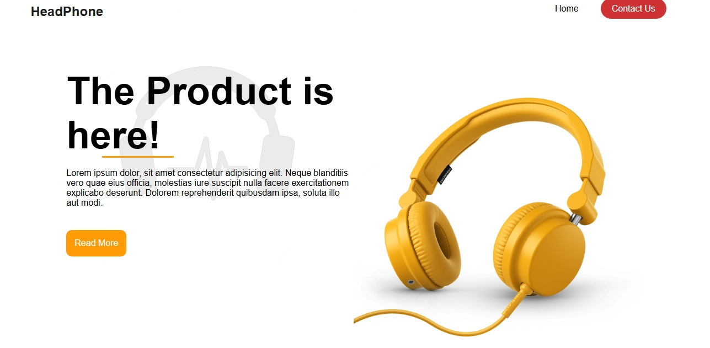
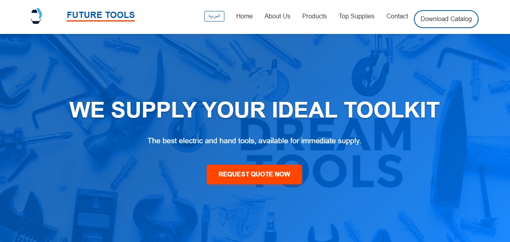

# My Web Learning 💻

This repository documents my progress while learning **HTML, CSS, and JavaScript**.  
Here you can find my projects, live demos, and screenshots of my work.

---

## Live Demo

Check out the **live demo of all my projects** in one place:  
[🌐 Open Live Demo](https://hamed-abu-sallam.github.io/my-web-learning)

---

## Projects

| Project | Description | Live Demo | Screenshot |
|---------|------------|-----------|------------|
| Brand1 Tech | Simple HTML + CSS product page showcasing a headphone | [Live](https://hamed-abu-sallam.github.io/my-web-learning/projects/brand1-tech/) |  |
| Company Portfolio | Modern, responsive, bilingual website designed for an engineering & industrial company. Supports Arabic (RTL) and English (LTR) with instant language switching without page reload. | [Live](https://hamed-abu-sallam.github.io/my-web-learning/projects/Company_Portfolio/) |  |

---

## About

These projects represent my journey learning web development.  
I am continuously updating this repository with new projects, showing a **well-organized progress path** for anyone interested in exploring the basics of web development.

---

## How to View Locally

1. Clone the repository:

```bash
git clone https://github.com/hamed-abu-sallam/my-web-learning.git
